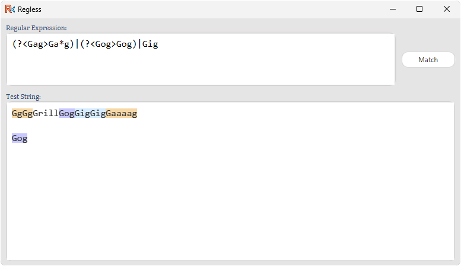

# Regless

Visual tool for assisting in writing and understanding regular expressions.

Typing a regular expression in the top field will highlight the contents of the bottom.
Different named capture groups have different colours.

